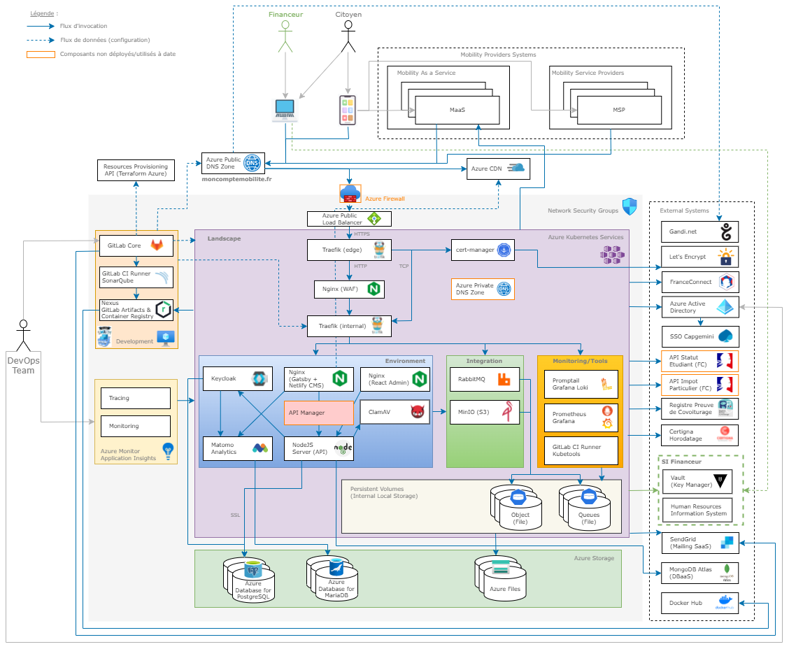

# Description

Le service administration se base sur le framework **[React-Admin](https://marmelab.com/react-admin/)**

⚠ La version utilisée est la v3.19.11 de React-Admin

Ce service permet, pour un administrateur fonctionnel, de gérer et de contribuer sur différents types de contenus (Aides, entreprises, collectivités, communautés ...) proposés et/ou à gérer dans la solution.

# Installation en local

Modifier le fichier json présent dans le dossier public avec les variables mentionnées ci-dessous

```sh
yarn install && yarn start
```

## Variables

| Variables               | Description                               | Obligatoire |
| ----------------------- | ----------------------------------------- | ----------- |
| IDP_FQDN                | Url de l'IDP                              | Oui         |
| API_FQDN                | Url de l'api                              | Oui         |
| IDP_MCM_REALM           | Nom du realm mcm                          | Oui         |
| IDP_MCM_ADMIN_CLIENT_ID | Client id du client public administration | Oui         |

## URL / Port

- URL : localhost
- Port : 3001

# Précisions pipelines

L'image de l'administration est basée sur nginx.

La variable PACKAGE_VERSION (voir commons) permet de repérer la dernière version publiée

## Preview

Pas de précisions nécéssaires pour ce service

## Testing

Pas de précisions nécéssaires pour ce service

# Relation avec les autres services

Comme présenté dans le schéma global de l'architecture ci-dessous



React Admin est lié à l'api grâce à l'implémentation du dataProvider. Ainsi certains endpoints permettant la contribution sont ouverts à ce portail d'administration.

Il est aussi lié à l'idp pour l'accès au portail soit par un compte dédié, soit par une liaison identity provider avec notre Azure AD.

# Tests Unitaires

Pas de tests unitaires nécéssaires pour ce service
