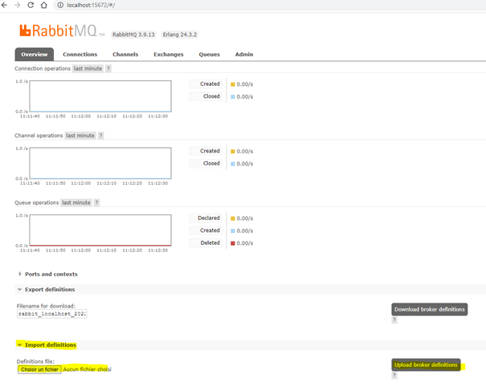

# Description

Le service bus se base sur la brique logicielle **[RabbitMQ](https://www.rabbitmq.com/)**

Cette brique de message broker permet au produit de s'interface avec les SIRH existants back-office des financeurs qu'ils utilisent déjà pour traiter les demandes d'aides à la mobilité. Ainsi, le financeur s'appuiera sur son SI existant pour les gérer et n'utilisera pas le back-office proposé par le produit.

Ci-dessous une vue globale du processus métier :


Concernant les échanges entre moB et le bus, le protocol amqp pour échanger des messages via la librairie [amqplib](https://www.npmjs.com/package/amqplib). [Lien](https://amqp-node.github.io/amqplib/) vers la documentation complète.

L'authentification via OAuth2 a été configuré pour les environnements distants permettant ainsi d'utiliser un jeton d'authentification émis par _idp_ pour pouvoir publier ou consommer des messages. Le plugin [rabbitmq_auth_backend_oauth2](https://github.com/rabbitmq/rabbitmq-server/tree/main/deps/rabbitmq_auth_backend_oauth2) a été utilisé pour cela, sa configuration est visible dans _bus/overlays/config/custom.conf_.


L'utilisation du fichier _definition.json_ présent dans le dossier _overlays_ permet de définir les configurations nécessaires au bon fonctionnement de l'échange des messages.
Elles correspondent à la solution d'architecture technique détaillée du bus ci-dessous mise en place :


# Installation en local
```sh
docker run -d --name rabbitmq -p 15672:15672 -p 5672:5672 -e RABBITMQ_USERNAME=${BUS_ADMIN_USER} -e RABBITMQ_PASSWORD=${BUS_ADMIN_PASSWORD} bitnami/rabbitmq:latest
```
Récupérer le fichier _overlays/definition.json_

## Variables

| Variables      | Description | Obligatoire |
| ----------- | ----------- | ----------- |
| BUS_ADMIN_USER      | Username pour la connexion au portail       | Oui |
| BUS_ADMIN_PASSWORD   | Password pour la connexion au portail        | Oui |
| BUS_MCM_CONSUME_USER   | Username pour la réception des messages        | Oui |
| BUS_MCM_CONSUME_PASSWORD   | Password pour la réception des messages        | Oui |
| IDP_API_CLIENT_SECRET   | Client secret du client confidentiel IDP pour l'API | Oui |
| CAPGEMINI_SECRET_KEY   | Client secret du client confidentiel CAPGEMINI pour l'API        | Non |

Importer, via l'interface RabbitMQ, le fichier _definition.json_ modifié avec les valeurs de variables mentionnées ci-dessus.



## URL / Port

Portail d'admin :
- URL : localhost
- Port : 15672

Node port :
- URL : localhost
- Port : 5672

# Précisions pipelines

## Preview

Pas de précisions nécéssaires pour ce service

## Testing

Le fichier definition.json n'est pas importé au déploiement. Il faudra l'importer manuellement comme précisé pour l'installation locale.

Le deploiement du bus est de type statefulSet.


# Relation avec les autres services

Comme présenté dans le [schéma d'architecture détaillée](docs/assets/MOB-CME_Archi_technique_detaillee.png), _api_ possède un [child process](https://nodejs.org/api/child_process.html) qui au démarrage de l'application permet d'écouter les messages disponibles sur les queues de consommation.

- _api_ effectue une requête amqp vers _bus_ pour envoyer les données de souscriptions, messages à destination des HRIS
- _api_ effectue des requêtes périodiquement vers _bus_ pour récupérer les données de statut des souscriptions, messages publiés par les HRIS

**Bilan des relations:**

- Publication de messages sur les queues _mob.subscriptions.put.*_
- Consommation des messages sur les queues _mob.subscriptions.status.*_


# Tests Unitaires

Pas de tests unitaires nécéssaires pour ce service

